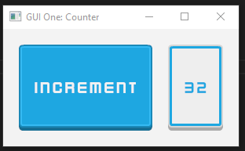
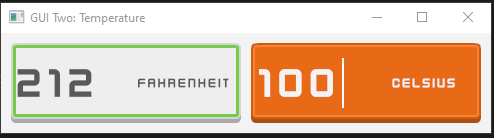

My implementation of the 7gui tasks in Rust, within the Amethyst engine. 

## One
A simple counter ui with a button and a label.

## Two
A temperature converter with two text entry fields and respective labels.

